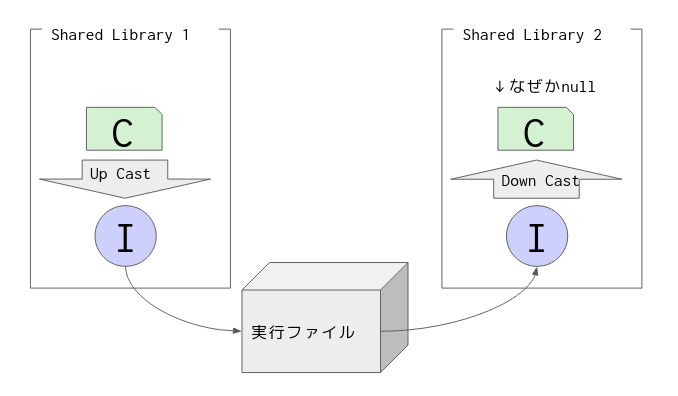
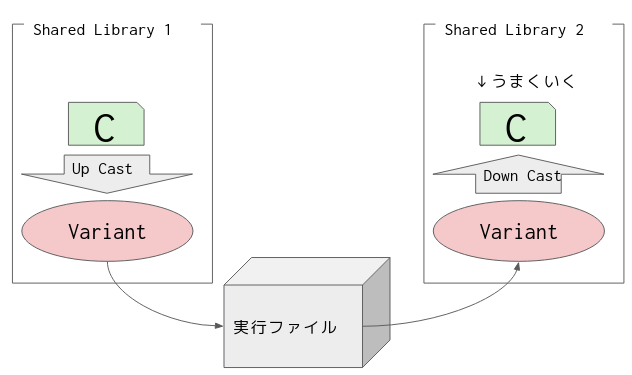

最近気づいた現象。(バグ？)

あるインターフェース`I`があって、これを実装したクラス`C`がShared library 1にある。

これを型`I`として実行ファイル越しにShared library 2に送り、`C`にダウンキャストする。

この時、実行ファイル側に`C`の情報がないとダウンキャストが失敗する。



具体的には以下のような状態。

>type.d
>```c
>interface I { }
>```
>
>dll1.d
>```c
>import type;
>class C : I {}
>I create() { return new C; }
>extern(C) string funcName() { return create.mangleof;}
>```
>
>dll2.d
>```c
>import type;
>import dll1;
>
>void use(I i) {
>    import std.stdio : writeln;
>    writeln(cast(C)i);
>}
>
>extern(C) string funcName() { return use.mangleof;}
>```
>
>main.d
>```c
>import std.experimental.all;
>import core.runtime;
>import core.sys.posix.dlfcn : dlsym, dlerror;
>import type;
>
>void main() {
>    execute(["dmd", "dll1.d", "type.d", "-shared", "-of=bin/dll1.so"]);
>    execute(["dmd", "dll2.d", "dll1.d", "type.d", "-shared", "-of=bin/dll2.so"]);
>
>    auto dll1 = Runtime.loadLibrary("bin/dll1.so");
>    auto dll2 = Runtime.loadLibrary("bin/dll2.so");
>
>    auto mangleOfCreate = (cast(string function())dlsym(dll1, "funcName".toStringz))();
>    auto mangleOfUse    = (cast(string function())dlsym(dll2, "funcName".toStringz))();
>
>    auto create = cast(I function())dlsym(dll1, mangleOfCreate.toStringz);
>    auto use = cast(void function(I))dlsym(dll2, mangleOfUse.toStringz);
>
>    use(create());
>}
>```

ちなみに実行ファイル側に`dll1.d`をリンクするとうまくいくのだが、私のユースケースではそういうわけにいかなかった。

これで非常に困っていたのだが、なんと[Variant](https://dlang.org/phobos/std_variant.html)を使うとあっさり解決した。



具体的には以下のようにする。


>dll1.d
>```c
>import std.variant;
>class C {}
>Variant create() { return Variant(new C); }
>extern(C) string funcName() { return create.mangleof;}
>```
>
>dll2.d
>```c
>import std.variant;
>import dll1;
>
>void use(Variant v) {
>    import std.stdio : writeln;
>    writeln(v.get!C);
>}
>
>extern(C) string funcName() { return use.mangleof;}
>```
>
>main.d
>```c
>import std.experimental.all;
>import core.runtime;
>import core.sys.posix.dlfcn : dlsym, dlerror;
>import type;
>
>void main() {
>    execute(["dmd", "dll1.d", "type.d", "-shared", "-of=bin/dll1.so"]);
>    execute(["dmd", "dll2.d", "dll1.d", "type.d", "-shared", "-of=bin/dll2.so"]);
>
>    auto dll1 = Runtime.loadLibrary("bin/dll1.so");
>    auto dll2 = Runtime.loadLibrary("bin/dll2.so");
>
>    auto mangleOfCreate = (cast(string function())dlsym(dll1, "funcName".toStringz))();
>    auto mangleOfUse    = (cast(string function())dlsym(dll2, "funcName".toStringz))();
>
>    auto create = cast(Variant function())dlsym(dll1, mangleOfCreate.toStringz);
>    auto use = cast(void function(Variant))dlsym(dll2, mangleOfUse.toStringz);
>
>    use(create());
>}
>```

なぜだ...
