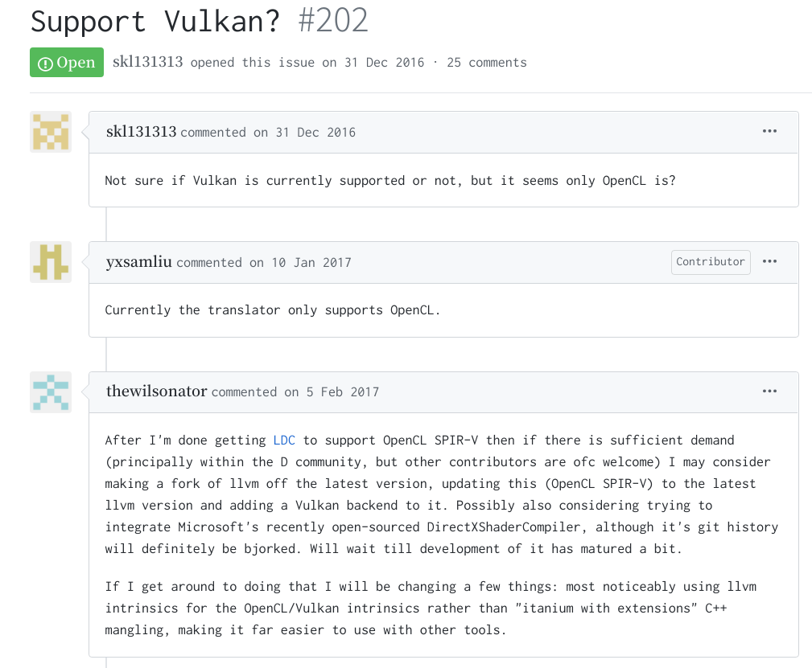

# D言語でShaderを書いてみた
何言ってんだこいつってかんじですが、呼んで字のごとくです。  
本当は成果も中途半端で出し渋るレベルの状態なんですが、真面目にやっていくと流石に心が折れそうだったのでここらへんで報告記事を出して一区切りつけようかと思った次第です。  

## kwsk
つまり何をしたかということなんですが、こういうわけです

1. D言語でShaderっぽいコードを書く
1. [LDC](https://github.com/ldc-developers/ldc)(D言語のLLVMバックエンドコンパイラ)でLLVM-IRに変換
1. 自作のトランスパイラを噛ませてLLVM-IRをSPIR-V(Vulkanとか用の中間言語)に変換

これでD言語で書いたコードがShaderとしてVulkan上で実行できるようになります。
実際にやってみた結果がこちらです。
コードは[こちら](https://github.com/Sobaya007/shader.d/commit/bd2d2da9497587a425b7b282c4a9fa0279cb189c)。

<blockquote class="twitter-tweet" data-partner="tweetdeck"><p lang="ja" dir="ltr">やっと出ました！！！<a href="https://twitter.com/hashtag/%E7%94%A3%E5%9C%B0%E7%9B%B4%E9%80%81?src=hash&amp;ref_src=twsrc%5Etfw">#産地直送</a> <a href="https://t.co/ALZ17AAC1h">pic.twitter.com/ALZ17AAC1h</a></p>&mdash; そばや (@sobaya007) <a href="https://twitter.com/sobaya007/status/1211884860261859328?ref_src=twsrc%5Etfw">December 31, 2019</a></blockquote>
<script async src="https://platform.twitter.com/widgets.js" charset="utf-8"></script>

私の顔のほうが目立ちますが、見てほしいのは白い三角形のほうです。こいつのフラグメントシェーダはこんなかんじになっています。
```d
import shader.builtin;
import shader.attribute;
import spirv.spv;
import ldc.attributes;

extern(C):

@output {
    vec4 color;
}

@entryPoint(ExecutionModel.Fragment)
@execMode(ExecutionMode.OriginUpperLeft)
void fragMain() {
    color = vec4([1.0, 1.0, 1.0, 1.0]);
}
```
確かにいいかんじにD言語で書けています。  
様々なサブ情報はUDAでゴリっています。
あと2020年1月6日現在、LDCでは変数に属性を仕込めないので、それ用の変更を施したLDCをビルドして使っています。

## まとめ
とまぁこんなかんじの年末年始でした。  
こいつに関してはちょっと先行きが不安すぎるのでいい経験だったと思って手を引こうと思っています。暇な方いたらぜひ続きをどうぞ。
今年もどこへ向かうかはわからないけれど、少なくとも立ち止まらないようにはしていきたいですね。

ということで、端的に内容が知りたい方はここまでで大丈夫です。
以下は見なくていいです。


## TL;DR
今回やったことの肝はLLVM-IRからSPIR-Vへの変換のところですね。  
実はLLVM-IRとSPIR-Vは結構instructionの単位とかが似通っており、パッと見変換は容易に見えます(少なくとも始める前の私にはそう見えました)し、実際LLVM-IRとSPIR-Vの相互変換ライブラリは[存在](https://github.com/KhronosGroup/SPIRV-LLVM-Translator)します。  
かの悪名高き[DCompute](https://github.com/libmir/dcompute)もOpenCLバックエンドモードのときは実はこいつを使っています。  

ではなぜ既に存在するソレを使わなかったのか。
それはなんと...


<div style="font-size:200%;"> 既存のライブラリではVulkan用のSPIR-Vは吐けないのです！！！</div>  

ぬぁぬぁぬぁぬぁんだっとぅぇぇええええええええええ??!!?!?!?!?

そう、これが長年抱えていた悩みだったのです。  
この旨はちゃんと当局も把握しており、過去のレポジトリでは[Vulkan、サポートせぇへんのか？](https://github.com/KhronosGroup/SPIRV-LLVM/issues/202)というIssueが立っていたほどです。  
(ちなみにこのIssueを投げているのはDComputeを作った方)(草)


なんでこんな悲劇が起きてしまったのか。  
SPIR-Vは某Khronosさん達が作ったGPUバイナリ用の中間表現です。VulkanやOpenGL、OpenCLといったKhronos謹製のソフトウェアが皆同じ形式で開発できるようにしましょうというのが最初のモチベーションだったはずです。  
しかしその内情はそんな理想とは遠くかけ離れたものでした。  
SPIR-Vは形式としては統一されていますが、[仕様書](https://www.khronos.org/registry/spir-v/specs/unified1/SPIRV.html)を見てみると「OpenCLの場合はこう。そうじゃないときはこう。」みたいな文言が至るところに散りばめられています。  
そもそもShader Stageとかいう概念がOpenGLやVulkanなんかにはありますが、OpenCLにはありません。  
APIの違いに由来する修飾子の違いもあります。  
そんなこともありまして、どちらもサポートするというのは難しいという実態がありました。  
ということでKhronosがまずTranslatorを作ったのはOpenCLのほうだったのです。  

...いやいやいやおかしくないか？そもそもの話、確かにOpenCLはSPIR-Vを中間言語としてサポートしていますが、その対応バージョンはOpenCL2.1以降と[公式](https://www.khronos.org/registry/OpenCL/specs/2.2/pdf/OpenCL_Env.pdf)が表明しています。そしてOpenCL2.1以降に対応しているのは[曰く](https://github.com/intel/compute-runtime)第8世代以降のCPUのみ。**そんな依然マイナーなもんサポートする前にVulkanサポートしろやああああああああああああああ**Vulkanなんて私のクソ雑魚PCのi7-4600でも動いてんたぞ？？あぁ？

と思い、このような暴挙に出たわけです。

先に全体としての感想を述べておくと、**こればっかりはD言語じゃないほうがよかった**と思いました。結構単純な変換なので、RustとかHaskellとかのほうが良かったんじゃないですかね。まぁRustなら[既にある](https://github.com/MaikKlein/rlsl)んですけど。

### 辛かったこと
以下、辛かったことです。

#### 辛かったこと1 : LLVMのC APIがショボい
もともとLLVMはC++で書かれているので純正のAPIはC++で叩くのが正攻法なのですが、一応多言語対応のためかC APIも存在しています。  
ですがこのC APIが微妙にショボい！ なんか足りない関数があったり、(これはある種しょうがないのですが)型情報が消失していたりします。  
これに対し私がどう取り組んだかというと、**足りない機能を見つけるたびにbindingを作っていました**。  
まぁやるだけなんで慣れちゃえばそう苦痛なことではないんですが、この結論にたどり着くまでにいろいろと回り道をして無駄に時間を使いました。

#### 辛かったこと2 : LDCがイカしたIRを吐いてくる
例えばベクトル型の構造体を宣言して、それを代入するとします。
```d
struct Vector(T, size_t N) {
    this(Repeat!(N,T) args); //なんか適当なコンストラクタ
}
Vector!(float,4) a = Vector!(float,4)(1,2,3,4);
```
こんなかんじのコードを書くと、LDCさん、代入文を消しやがります。  
いやわかるけどちゃうねん。  
私はコンパイラさんの気持ちを汲み取って泣く泣く構造体にメンバを生やします。
```d
struct Vector(T, size_t N) {
    this(Repeat!(N,T) args); //なんか適当なコンストラクタ
    Repeat!(N,T) tmp; // 適当に生やしたメンバ
}
```
するとこんなかんじのことを言い出します。
```
%1 = bitcast %"Vector!(float, 4LU).Vector"* %1 to i8*
%2 = bitcast %"Vector!(float, 4LU).Vector"* %.structliteral to i8*
call void @llvm.memcpy.p0i8.p0i8.i64(i8* align 1 %1, i8* align 1 %2, i64 16, i1 false)
  ```
要は**srcとdstをどっちもi8*型に変換して、memcpyで代入**ということをし始めます。  
はっはっは。かわいいやつめ。もうちょっと素直な子だったらなぁ。  

この件は結局simd用に容易されていた組み込みのvector型を使うことで一応は乗り切れました。(でもこれだと全然カスタムできないので辛さがある)

#### 辛かったこと3 : 研究してない
やべぇ

## 真のまとめ
ここまで読んでいただいてありがとうございます。  
こんな駄文をここまで読んでくださったということはきっと、そばやに対して一定の好意をお持ちのことと思います。  
その温かい気持ちをできれば[ここらへん](https://github.com/Sobaya007/repl.d)のレポジトリにStarを生やすという形で体現してみてはいかがでしょうか。  
今年も良い1年でありますようお祈り申し上げます。
